# 🛍️ ShopFlow

> A production-grade distributed e-commerce platform built on microservices architecture — demonstrating end-to-end mastery of backend engineering, distributed systems patterns, full-stack development, and cloud-native deployment.

<div align="center">

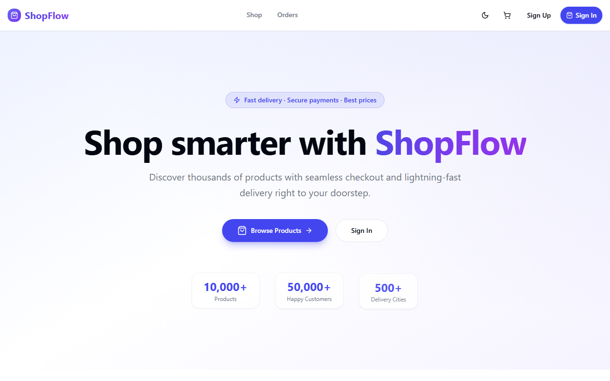

</div>

---

## 📋 Table of Contents

- [Overview](#-overview)
- [Screenshots](#-screenshots)
- [Architecture](#-architecture)
- [Tech Stack](#-tech-stack)
- [Animations (GSAP)](#-animations-gsap)
- [Microservices](#-microservices)
- [Quickstart](#-quickstart)
- [Default Credentials](#-default-credentials)
- [API Endpoints](#-api-endpoints)
- [Observability](#-observability)
- [Project Structure](#-project-structure)

---

## 🚀 Overview

ShopFlow is a full-featured e-commerce platform that mirrors the architectural patterns used at companies like Amazon, Shopify, and Flipkart. It is intentionally built at production depth — not a toy project — featuring event-driven sagas, RBAC-secured APIs, distributed tracing, and a fully functional admin panel.

**What it demonstrates:**
- 🏛️ Domain-driven microservices with independent databases
- 🔄 Saga orchestration pattern for distributed transactions
- 🔐 JWT + OAuth2 authentication via Keycloak
- 📨 Event-driven architecture with Apache Kafka
- 📊 Full observability: metrics, distributed tracing, and logs
- 🐳 Container-first deployment with Docker Compose and Kubernetes manifests

---

## 📸 Screenshots

### 🏠 Landing Page

The hero section greets visitors with animated stats, a gradient headline, and a clear call-to-action. ShopFlow supports both **light** and **dark** themes — toggled from the navbar and persisted to `localStorage`.

<table>
  <tr>
    <td></td>
    <td>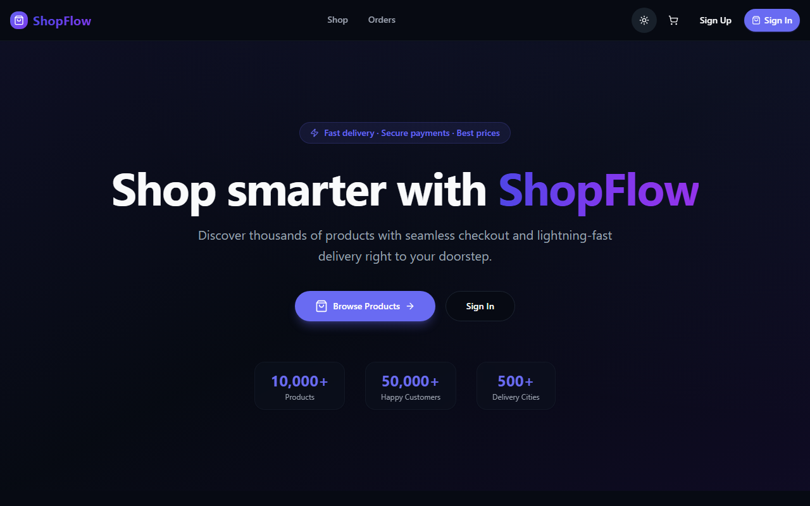</td>
  </tr>
  <tr>
    <td align="center"><em>Light Mode</em></td>
    <td align="center"><em>Dark Mode</em></td>
  </tr>
</table>

---

### 🛒 Shop — Product Catalog

Browse the full product catalog with **category filtering**, **live search**, and stock indicators. Products animate in with a staggered GSAP effect on load.

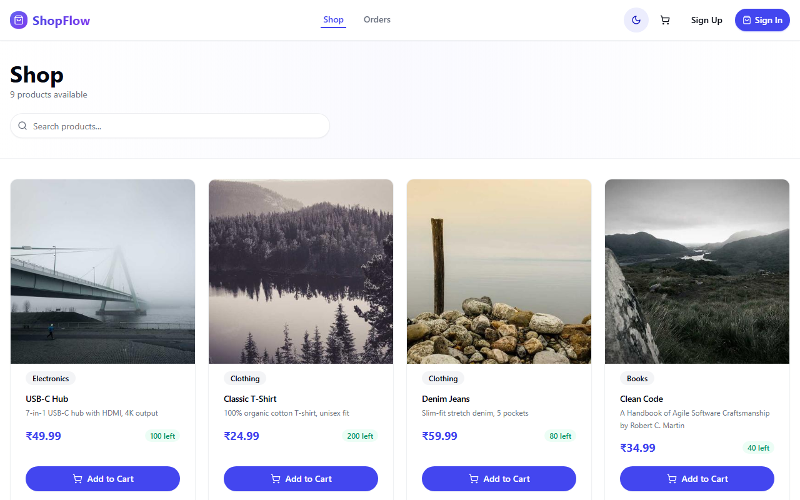

**Smart Search** — powered by OpenSearch with full-text support and typo tolerance:

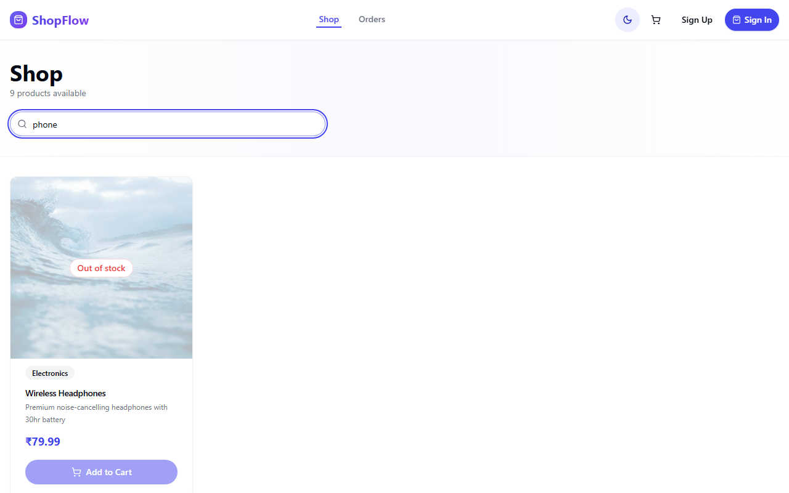

---

### 🔐 Authentication — Keycloak SSO

Sign-in and registration are handled entirely by **Keycloak** — a production-grade identity provider. Users are redirected to the Keycloak realm, then returned to the app with a signed JWT. New registrations are automatically assigned the `CUSTOMER` role.

<table>
  <tr>
    <td>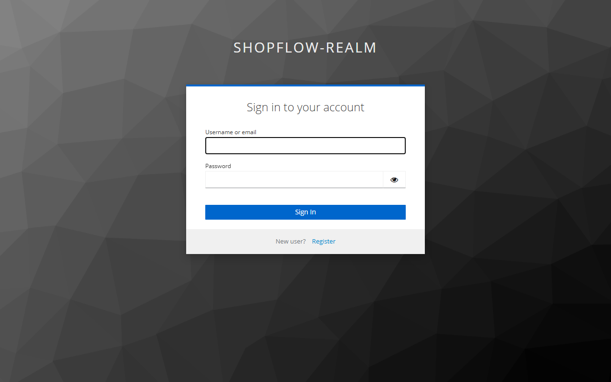</td>
    <td>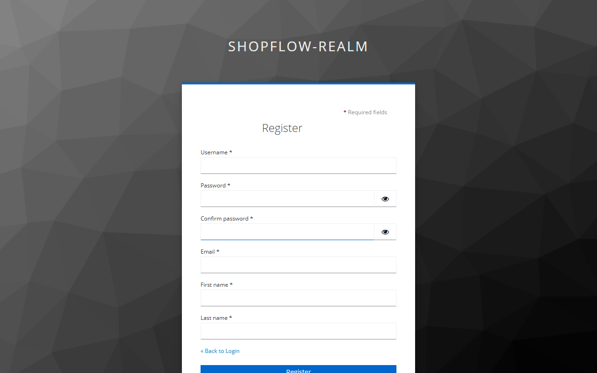</td>
  </tr>
  <tr>
    <td align="center"><em>Sign In</em></td>
    <td align="center"><em>Create Account</em></td>
  </tr>
</table>

After signing in, the navbar updates instantly — **Sign Up / Sign In** buttons are replaced by the account icon, admin dashboard link (if admin), and **Sign Out**:

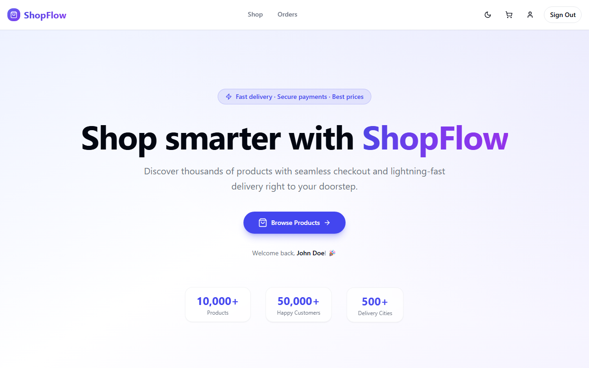

---

### 🧺 Cart

Adding products updates the cart badge in real time. The cart page shows product thumbnails, a live `− N +` quantity stepper, per-item pricing, and a running total. The **Clear Cart** button wipes everything; dropping quantity to zero automatically removes the item.

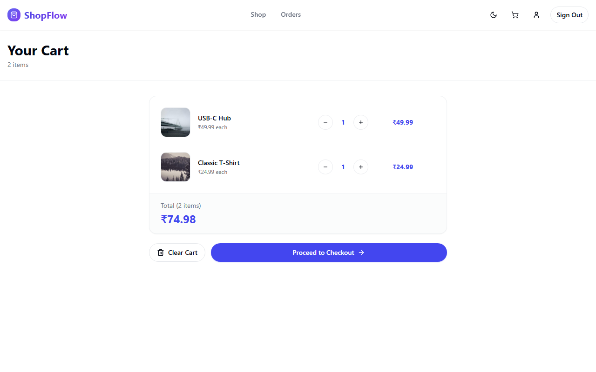

---

### 💳 Checkout

Two-step checkout: review the order summary, then choose a payment method. **Cash on Delivery** confirms immediately. **Pay Online** reveals a card entry form with auto-formatting for card number, expiry, and CVV.

<table>
  <tr>
    <td>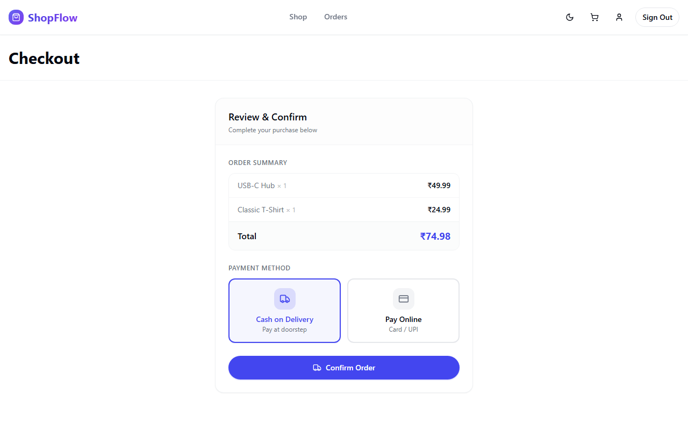</td>
    <td>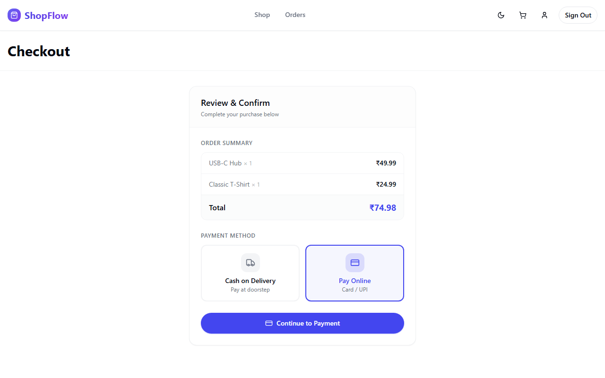</td>
  </tr>
  <tr>
    <td align="center"><em>Cash on Delivery</em></td>
    <td align="center"><em>Pay Online (Card / UPI)</em></td>
  </tr>
</table>

---

### ✅ Order Confirmation

After placing an order the saga orchestrator kicks off asynchronously — inventory is reserved, payment is processed, and Kafka events notify downstream services. The customer sees a confirmation screen with their unique order ID.

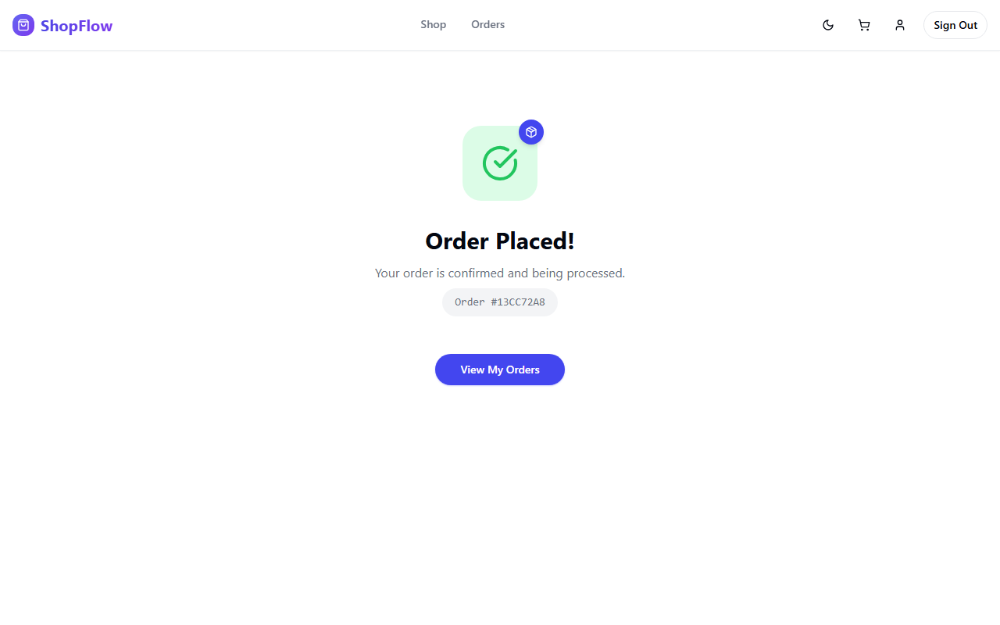

---

### 📦 Order History

All past and current orders are listed chronologically with order IDs, item breakdowns, totals, and real-time status badges (Pending / Confirmed / Shipped / Cancelled).

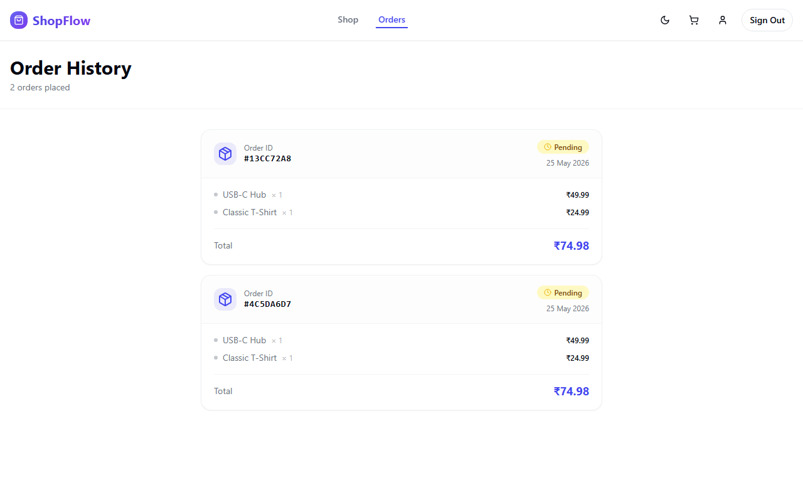

---

### 👤 Account

The account page displays the user's profile with a gradient avatar, verified badge, email, and full name pulled from the Keycloak JWT. One-click sign out is available both here and in the navbar.

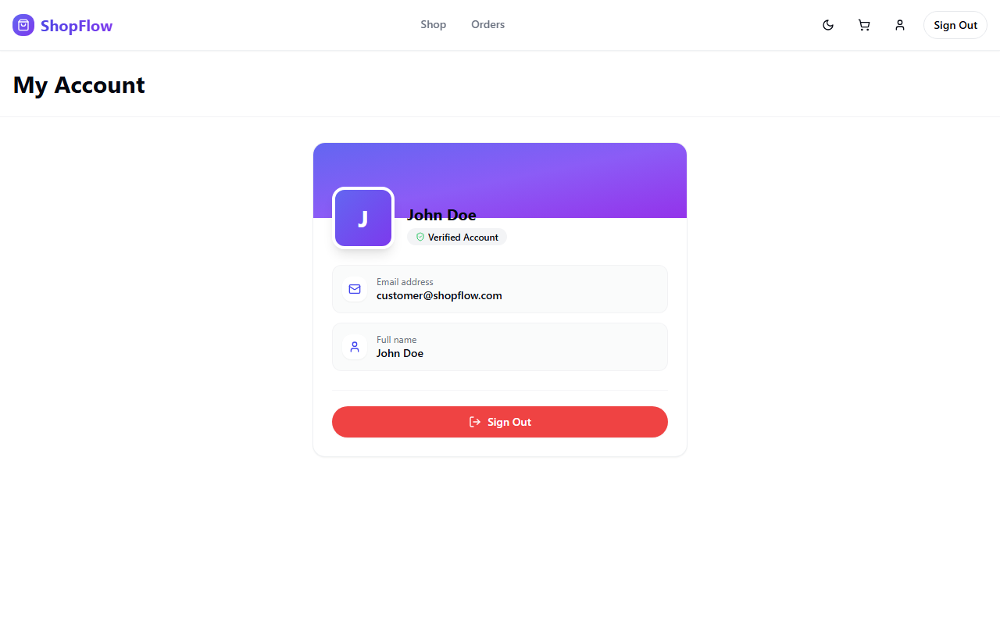

---

### 🔧 Admin Panel

Admin users get an exclusive `/admin` route — accessible via the dashboard icon in the navbar. The entire panel is protected at both the frontend (route guard) and backend (`@PreAuthorize("hasRole('ADMIN')")`) levels.

**Products Tab** — full CRUD: add new products, edit details, upload images (from device or URL), toggle active/inactive status:

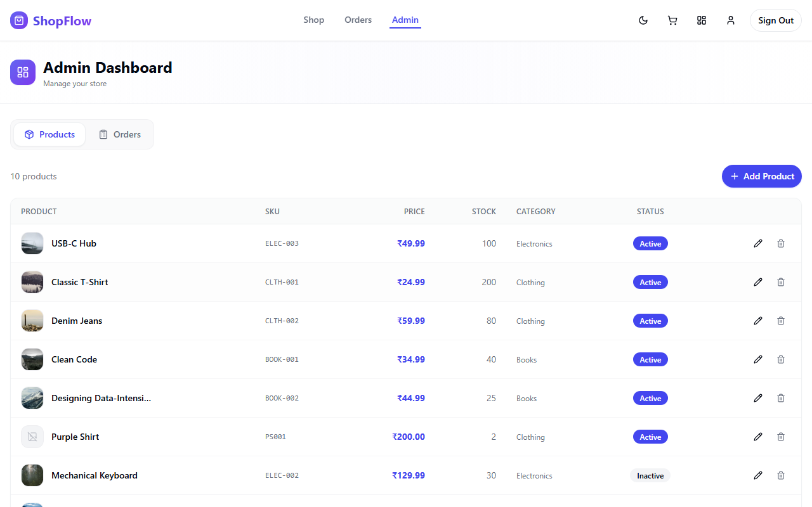

**Orders Tab** — view all orders across all customers and update their status via a dropdown. Only valid state transitions are shown (e.g. a shipped order cannot go back to pending):

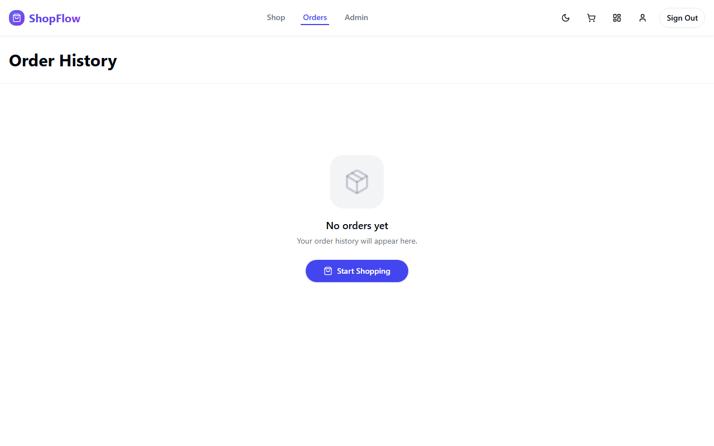

---

## 🏗️ Architecture

```
┌─────────────────────────────────────────────────────────┐
│                      Browser / React UI                  │
│     (Vite + TypeScript + Tailwind + ShadCN + GSAP)       │
└────────────────────────┬────────────────────────────────┘
                         │ HTTP (port 3000)
                         ▼
┌─────────────────────────────────────────────────────────┐
│              Spring Cloud Gateway  :8085                 │
│       JWT validation · Rate limiting · Routing           │
└──┬──────────┬──────────┬──────────┬──────────┬──────────┘
   │          │          │          │          │
   ▼          ▼          ▼          ▼          ▼
┌──────┐ ┌───────┐ ┌──────┐ ┌───────┐ ┌─────────┐
│User  │ │Catalog│ │Cart  │ │Order  │ │Payment  │
│Svc   │ │Svc    │ │Svc   │ │Svc    │ │Svc      │
│:8081 │ │:8082  │ │:8083 │ │:8085  │ │:8084    │
└──┬───┘ └───┬───┘ └──┬───┘ └───┬───┘ └────┬────┘
   │         │        │         │           │
   ▼         ▼        ▼         ▼           ▼
 PG DB    PG DB +  Redis DB   PG DB      PG DB
         OpenSearch
                              │
                         ┌────▼────┐
                         │  Kafka  │
                         └────┬────┘
                              │
                    ┌─────────▼──────────┐
                    │  Notification Svc  │
                    │       :8086        │
                    └────────────────────┘

 Auth: Keycloak :8080   Tracing: Jaeger :16686
```

---

## 🛠️ Tech Stack

### Frontend
| Layer | Technology |
|---|---|
| Framework | React 19 + Vite + TypeScript |
| Styling | Tailwind CSS + ShadCN/UI |
| Animations | GSAP 3.15 |
| Icons | Lucide React |
| Routing | React Router v6 |
| Auth Client | Keycloak-JS |

### Backend
| Layer | Technology |
|---|---|
| Language | Java 21 LTS |
| Framework | Spring Boot 3.2 |
| Security | Spring Security + OAuth2 Resource Server |
| Persistence | Spring Data JPA + Hibernate |
| Messaging | Apache Kafka (KRaft mode) |
| Build | Maven |
| API | REST |

### Databases & Infrastructure
| Service | Technology | Purpose |
|---|---|---|
| Primary DB | PostgreSQL 16 | Orders, catalog, payments, users |
| Cache | Redis 7 | Cart sessions, rate limiting |
| Search | OpenSearch 2.11 | Full-text product search |
| Auth | Keycloak 24 | SSO, OAuth2, RBAC, JWT |
| Broker | Apache Kafka 7.5 | Async events & saga orchestration |
| Gateway | Spring Cloud Gateway | Routing, JWT validation, rate limits |
| Tracing | Jaeger + OpenTelemetry | Distributed trace collection |
| Metrics | Prometheus + Grafana | RED metrics dashboards |

### Testing
| Layer | Technology |
|---|---|
| Unit | JUnit 5 + Mockito |
| Integration | Testcontainers (Postgres, Redis, Kafka) |
| API | RestAssured |

### Deployment
| Layer | Technology |
|---|---|
| Containers | Docker + Docker Compose |
| Orchestration | Kubernetes (manifests in `/k8s`) |
| CI/CD | GitHub Actions |

---

## 🎬 Animations (GSAP)

The frontend uses **GSAP 3.15** for smooth, choreographed animations across every page. All animations follow the React-safe `gsap.context()` pattern with automatic cleanup via `ctx.revert()` on unmount — no memory leaks.

### Animation Breakdown

| Page / Component | Animation | Technique |
|---|---|---|
| **Navbar** | Slides down from above on first load | `gsap.fromTo(ref, { y: -70, opacity: 0 }, ...)` |
| **Home — Hero** | Staggered timeline: badge → title → subtitle → CTA → stats → feature cards → CTA banner | `gsap.timeline()` with `'-=0.2'` overlap offsets |
| **Shop — Product Grid** | Cards fade + rise in staggered after data loads | `gsap.set(cards, { opacity:0, y:36, scale:0.94 })` then `gsap.to(...)` |
| **Cart — Item Rows** | Each row slides in from the left, summary fades up | `gsap.set` + `gsap.to` with `stagger: 0.08` |
| **Orders — Order Cards** | Cards rise in with slight scale from 0.97 | `gsap.set` + `gsap.to` with `stagger: 0.1` |
| **Account** | Card surges up from below; info rows slide in from left with delay | `gsap.fromTo(ref, ...)` + scoped `querySelectorAll('.info-row')` |

### Key Pattern Used

```tsx
useEffect(() => {
  const ctx = gsap.context(() => {
    const tl = gsap.timeline({ defaults: { ease: 'power3.out' } })
    tl.fromTo('.hero-badge',  { opacity: 0, y: -24 }, { opacity: 1, y: 0, duration: 0.5 })
      .fromTo('.hero-title',  { opacity: 0, y: 56  }, { opacity: 1, y: 0, duration: 0.75 }, '-=0.2')
      .fromTo('.hero-sub',    { opacity: 0, y: 32  }, { opacity: 1, y: 0, duration: 0.6  }, '-=0.4')
      .fromTo('.feat-card',   { opacity: 0, y: 50, scale: 0.95 },
              { opacity: 1, y: 0, scale: 1, stagger: 0.14 }, '-=0.15')
  }, heroRef)

  return () => ctx.revert() // cleanup on unmount
}, [])
```

> **Rule:** Never set `style={{ opacity: 0 }}` inline on elements. For data-driven lists (products, orders, cart items), use `gsap.set(elements, { opacity: 0 })` inside the `useEffect` right before `gsap.to()`.

---

## 🔌 Microservices

### API Gateway `:8085`
Spring Cloud Gateway — single entry point for all traffic. Validates JWTs, enforces rate limits, routes requests to downstream services.

### User Service `:8081`
Manages shipping addresses and user profile data. PostgreSQL backed.

### Catalog Service `:8082`
Product CRUD with OpenSearch full-text indexing. Admins can add/edit/delete products. Images stored as TEXT (base64) in PostgreSQL.

### Cart Service `:8083`
Redis-backed shopping cart. Add, update quantity, remove items. Cart keyed by user ID from JWT subject.

### Order Service `:8085` (internal)
Core saga orchestrator. Manages the full order lifecycle with state machine enforcement and Kafka event publishing.

### Payment Service `:8084`
Simulated payment processing with idempotency key enforcement and webhook handling architecture.

### Notification Service `:8086`
Kafka consumer that handles `OrderCreated` and `PaymentCompleted` events. Runs in mock mode locally (logs instead of sending emails).

---

## ⚡ Quickstart

### Prerequisites
- 🐳 [Docker Desktop](https://www.docker.com/products/docker-desktop/) (with Compose V2)
- 💾 8 GB RAM recommended (all containers combined)

### 1. Clone and start

```bash
git clone https://github.com/your-username/shopflow.git
cd shopflow
docker compose up -d
```

Docker Compose will pull all images and start every service in the correct dependency order. First run takes 3–5 minutes.

### 2. Wait for services to be ready

```bash
docker compose ps          # all should show "running"
docker compose logs -f     # watch startup logs
```

### 3. Open the app 🎉

| Service | URL |
|---|---|
| 🛍️ Storefront | http://localhost:3000 |
| 🔐 Keycloak Admin | http://localhost:8080/admin |
| 🔭 Jaeger Tracing | http://localhost:16686 |
| 📨 Kafka | localhost:9092 |
| 🐘 PostgreSQL | localhost:5432 |
| ⚡ Redis | localhost:6379 |
| 🔍 OpenSearch | http://localhost:9200 |

---

## 🔑 Default Credentials

### Customer Account
| Field | Value |
|---|---|
| Username | `test_customer` |
| Password | `password` |
| Email | customer@shopflow.com |
| Role | CUSTOMER |

### Admin Account
| Field | Value |
|---|---|
| Username | `test_admin` |
| Password | `password` |
| Email | admin@shopflow.com |
| Role | ADMIN |

### Keycloak Admin Console
| Field | Value |
|---|---|
| URL | http://localhost:8080/admin |
| Username | `admin` |
| Password | `admin` |

> 💡 New users who register via the Sign Up button are auto-assigned the CUSTOMER role via Keycloak's default role configuration.

---

## 📡 API Endpoints

All requests go through the API Gateway at `http://localhost:3000/api/v1/...` (or directly to each service port in development).

### Catalog
| Method | Path | Auth | Description |
|---|---|---|---|
| GET | `/catalog/products` | Public | Paginated product list |
| GET | `/catalog/products/{id}` | Public | Single product |
| GET | `/catalog/products/admin/all` | ADMIN | All products (no pagination limit) |
| POST | `/catalog/products` | ADMIN | Create product |
| PUT | `/catalog/products/{id}` | ADMIN | Update product |
| DELETE | `/catalog/products/{id}` | ADMIN | Delete product |
| GET | `/catalog/search?q=...` | Public | Full-text search |

### Cart
| Method | Path | Auth | Description |
|---|---|---|---|
| GET | `/cart` | CUSTOMER | Get current cart |
| POST | `/cart/items` | CUSTOMER | Add item |
| PUT | `/cart/items/{productId}` | CUSTOMER | Update quantity |
| DELETE | `/cart/items/{productId}` | CUSTOMER | Remove item |

### Orders
| Method | Path | Auth | Description |
|---|---|---|---|
| POST | `/orders` | CUSTOMER | Place order |
| GET | `/orders` | CUSTOMER | Order history |
| GET | `/orders/admin/all` | ADMIN | All orders (all users) |
| PUT | `/orders/{orderId}/status` | ADMIN | Update order status |

### User
| Method | Path | Auth | Description |
|---|---|---|---|
| GET | `/users/addresses` | CUSTOMER | List addresses |
| POST | `/users/addresses` | CUSTOMER | Add address |
| DELETE | `/users/addresses/{id}` | CUSTOMER | Remove address |

---

## 📊 Observability

### 🔭 Distributed Tracing — Jaeger
Every HTTP request generates a trace spanning all services it touches. Open http://localhost:16686, select a service, and click "Find Traces" to see the full call chain with timing.

### 📈 Metrics — Prometheus + Grafana
Spring Boot Actuator exposes `/actuator/prometheus` on each service. Prometheus scrapes all services; Grafana renders RED dashboards (Rate / Errors / Duration).

```bash
# Start the observability stack separately
docker compose -f observability/docker-compose.yml up -d
```

### 📝 Structured Logs
Every log line includes `traceId` and `spanId` fields, enabling log-to-trace correlation in Grafana Loki.

```
2026-05-25 10:23:41 [http-nio-8082-exec-3] INFO  ProductController traceId=abc123 spanId=def456 - GET /api/v1/catalog/products
```

---

## 📁 Project Structure

```
shopflow/
├── api-gateway/              # 🚪 Spring Cloud Gateway
├── user-service/             # 👤 User profile & address management
├── catalog-service/          # 📦 Product catalog + OpenSearch indexing
├── cart-service/             # 🧺 Redis-backed cart
├── order-service/            # 📋 Saga orchestrator + order lifecycle
├── payment-service/          # 💳 Payment processing + idempotency
├── notification-service/     # 🔔 Kafka consumer + email dispatch
├── shopflow-frontend/        # ⚛️  React 19 + Vite + TypeScript + GSAP SPA
├── keycloak-init/            # 🔐 Realm config, roles, test users
├── docker/                   # 🐳 DB init SQL, shared Docker resources
├── k8s/                      # ☸️  Kubernetes manifests
├── observability/            # 📊 Prometheus + Grafana + Loki compose
├── docs/screenshots/         # 📸 Auto-generated UI screenshots
└── docker-compose.yml        # 🚀 Full local stack
```

---

## 🔄 Order Saga Flow

```
Customer places order
        │
        ▼
  Order Service
  (status: PENDING)
        │
        ├──► Kafka: inventory.reserve ──► [reserve stock]
        │                                       │
        │                               ◄── inventory.reserved
        │
        ├──► Kafka: payment.request ──► Payment Service
        │                                       │
        │                               ◄── payment.result
        │
        ▼
  ✅ status: CONFIRMED  ──── OR ────  ❌ status: FAILED
                                  (compensate: release stock, refund)
```

---

## 🔐 Keycloak & Security

- 🏰 **Realm:** `shopflow-realm`
- 👥 **Roles:** `CUSTOMER` (default for all new registrations), `ADMIN`
- 🎫 **Token:** JWT with `realm_access.roles` claim — mapped to Spring Security `ROLE_CUSTOMER` / `ROLE_ADMIN` authorities via a custom `JwtAuthenticationConverter`
- 🛡️ **Method Security:** `@PreAuthorize("hasRole('ADMIN')")` on all admin endpoints — enforced at the service layer, not just the gateway

---

*Built with ❤️ using Java 21 · Spring Boot 3.2 · React 19 · GSAP 3.15 · Keycloak 24 · Apache Kafka · PostgreSQL · Redis · OpenSearch · Docker*
